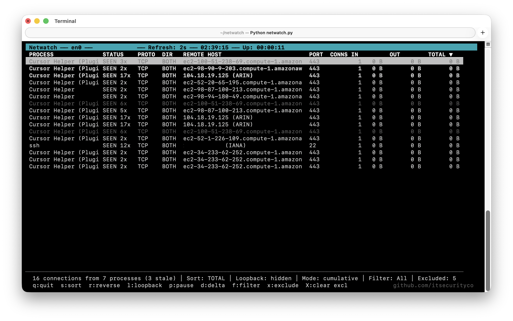

# Netwatch

Real-time terminal dashboard for monitoring per-process network connections on macOS. Combines `nettop` (byte counts) with `lsof` (full connection discovery) and resolves hostnames via DNS and whois lookups.



## Features

- Per-process view of all TCP/UDP connections with byte counters
- Async DNS resolution with whois organization fallback
- Connection history tracking (NEW vs SEEN across sessions)
- Interactive sorting, filtering, scrolling, and process exclusion
- Delta mode showing bytes/sec rates
- SQLite persistence for history, whois cache, and exclusions
- TTL-based row tracking (stale connections fade over 24h)

## Requirements

- macOS (uses `nettop`, `lsof`, `ipconfig`)
- Python 3.10+

## Usage

```bash
# Default interface (en0)
python3 netwatch.py

# Via module
python3 -m netwatch

# Custom interface
python3 netwatch.py en1
```

### Keyboard Controls


| Key       | Action                                              |
| --------- | --------------------------------------------------- |
| `s`       | Cycle sort key (total / process / conns / in / out) |
| `r`       | Toggle sort direction (asc/desc)                    |
| `f`       | Cycle filter (all / new only / known only)          |
| `d`       | Toggle delta mode (bytes/sec)                       |
| `p`       | Pause/resume data refresh                           |
| `l`       | Toggle loopback connections                         |
| `x`       | Exclude selected process                            |
| `X`       | Clear all exclusions                                |
| Up/Down   | Navigate rows                                       |
| `q` / Esc | Quit                                                |


## Architecture

```
netwatch.py                 Entry point (wrapper)
netwatch/
  __main__.py               Orchestrator: curses loop, service init
  config.py                 Constants, column layout, YAML config loader
  domain/
    entities.py             Connection + TrafficRow dataclasses
  services/
    traffic_collector.py    nettop/lsof parsing, endpoint parsing
    resolver.py             Async DNS + whois resolution
    aggregator.py           Row grouping, sorting, human_bytes, RowTracker
    history.py              Connection fingerprint + NEW/SEEN tracking
  storage/
    database.py             SQLite backend (history, whois, exclusions)
  ui/
    state.py                ApplicationState dataclass
    input_handler.py        Keyboard dispatch + KeyAction enum
    renderer.py             Curses drawing (header, table, footer)
tests/
  test_pure_logic.py        Unit tests for all pure logic
```

### Data Flow

```
  nettop ──> byte counts ──┐
                            ├──> merge ──> aggregate ──> enrich ──> sort ──> display
  lsof ───> connections ───┘       |           |           |                   |
                                   |       DNS/whois   history             curses
                              ProcessName   (async)    (NEW/SEEN)         renderer
                                cache
```

1. **Collect** -- `traffic_collector` runs `nettop` (active flows with byte counts) and `lsof` (all established connections), merging them into a unified `Connection` list.
2. **Aggregate** -- `aggregator` groups connections by (process, remote addr, port, proto) into `TrafficRow` objects, resolving display names via async DNS with whois fallback.
3. **Enrich** -- Each row gets a NEW/SEEN status from `ConnectionHistory` fingerprint tracking.
4. **Track** -- `RowTracker` keeps disappeared connections visible for 24 hours, marking them stale.
5. **Display** -- The curses renderer draws the table every 200ms. Data refreshes every 2 seconds.

### Persistence

All data is stored in `~/.netwatch/`:


| File            | Contents                                                    |
| --------------- | ----------------------------------------------------------- |
| `netwatch.db`   | SQLite: connection history, whois, excluded processes        |
| `config.yaml`   | Optional: `excluded_processes` list                         |
| `netwatch.log`  | Warnings and errors                                         |


## Testing

```bash
python3 -m pytest tests/ -v
```

Tests cover all pure logic with zero mocking: entities, endpoint parsing, whois parsing, display name formatting, exclusion matching, byte formatting, sorting, connection history, keyboard handling, config loading, and SQLite round-trips.

